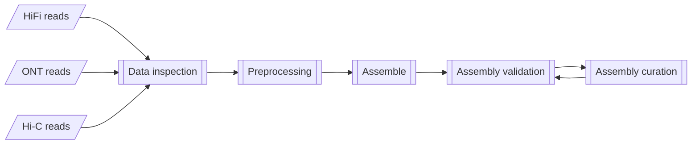
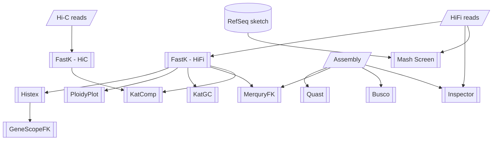

# Earth Biogenome Project - Pilot Workflow

The primary workflow for the Earth Biogenome Project Pilot at NBIS.

## Workflow overview

General aim:



Current implementation:



## Usage

```bash
nextflow run -params-file <params.yml> \
    [ -c <custom.config> ] \
    [ -profile <profile> ] \
    NBISweden/Earth-Biogenome-Project-pilot
```

where:
- `params.yml` is a YAML formatted file containing workflow parameters
    such as input paths to the data.

    Example:

    ```yml
    input: 'assembly_spec.yml'
    ```

    Alternatively parameters can be provided on the
    command-line using the `--parameter` notation (e.g., `--input <path>` ).
- `<custom.config>` is a Nextflow configuration file which provides
    additional configuration. This is used to customise settings other than
    workflow parameters, such as cpus, time, and command-line options to tools.

    Example:
    ```nextflow
    process {
        withName: 'BUSCO' {  // Selects the process to apply settings.
            cpus     = 6   // Overrides cpu settings defined in nextflow.config
            time     = 4.d // Overrides time settings defined in nextflow.config to 4 days
            // ext.args supplies command-line options to the process tool
            // overrides settings found in configs/modules.config
            ext.args = '--mode genome --long'  // Supplies these as command-line options to Busco  
        }
    }
    ```
- `<profile>` is one of the preconfigured execution profiles
    (`uppmax`, `singularity_local`, `docker_local`, etc: see nextflow.config). Alternatively,
    you can provide a custom configuration to configure this workflow
    to your execution environment. See [Nextflow Configuration](https://www.nextflow.io/docs/latest/config.html#scope-executor)
    for more details.


### Workflow parameter inputs

Mandatory:

- `input`: A YAML formatted input file.
    Example `assembly_spec.yml` (See also [test profile input](assets/test_hsapiens.yml)):

    ```yml
    sample:                # Required: Meta data
    id: 'HSapiens_test'  # Required: Name of the sample. Used commonly as a prefix.
    kmer_size: 31        # Required: K-mer size to use for k-mer analyses.
    ploidy: 2            # Required: Estimated ploidy of organism.
    busco_lineages:      # Optional: List of busco lineages to test against. default: 'auto'
        - "eukaryota_odb10"
        - "mammalia_odb10"
    assembly:              # Optional: List of assemblies to curate and validate.
    - id: 'HS_phased_diploid'  # Each assembly has it's own ID. Assemblies can be primary and alternate or primary only
        pri_fasta: 'https://raw.githubusercontent.com/nf-core/test-datasets/modules/data/genomics/homo_sapiens/genome/genome.fasta'
        alt_fasta: 'https://raw.githubusercontent.com/nf-core/test-datasets/modules/data/genomics/homo_sapiens/genome/genome2.fasta'
    - id: 'HS_consensus'
        pri_fasta: 'https://raw.githubusercontent.com/nf-core/test-datasets/modules/data/genomics/homo_sapiens/genome/genome2.fasta'
    hic:                   # Optional: List of hi-c reads to QC and use for scaffolding 
    - read1: 'https://raw.githubusercontent.com/nf-core/test-datasets/modules/data/genomics/homo_sapiens/illumina/fastq/test_1.fastq.gz'
        read2: 'https://raw.githubusercontent.com/nf-core/test-datasets/modules/data/genomics/homo_sapiens/illumina/fastq/test_2.fastq.gz'
    hifi:                  # Required: List of hifi-reads to QC and use for assembly/validation
    - reads: 'https://raw.githubusercontent.com/nf-core/test-datasets/modules/data/genomics/homo_sapiens/illumina/bam/test.paired_end.sorted.bam'
    rnaseq:                # Optional: List of Rna-seq reads to use for validation
    - read1: 'https://raw.githubusercontent.com/nf-core/test-datasets/modules/data/genomics/homo_sapiens/illumina/fastq/test_1.fastq.gz'
        read2: 'https://raw.githubusercontent.com/nf-core/test-datasets/modules/data/genomics/homo_sapiens/illumina/fastq/test_2.fastq.gz'
    isoseq:                # Optional: List of Isoseq reads to use for validation
    - reads: 'https://raw.githubusercontent.com/nf-core/test-datasets/modules/data/genomics/homo_sapiens/illumina/bam/test.paired_end.sorted.bam'
    ```


Optional:

- `outdir`: The publishing path for results (default: `results`).
- `publish_mode`: (values: `'symlink'` (default), `'copy'`) The file
publishing method from the intermediate results folders
(see [Table of publish modes](https://www.nextflow.io/docs/latest/process.html#publishdir)).
- `steps`: The workflow steps to execute ( default is all steps. Choose from [`data_qc`,`preprocess`,`assemble`,`validate`,`curate`] ).

    Software specific:
    - `multiqc_config`: Path to MultiQC configuration file (default: `configs/multiqc_conf.yaml`).

    Software package manager specific:
    - `enable_conda`: Set to `true` to use conda as the software package manager (default: `false`).
    - `singularity_pull_docker_container`: Set to `true` if Singularity images should be
    built from the docker images, instead of retrieving existing Singularity images (default: `false`).

    Uppmax cluster specific:
    - `project`: SNIC Compute allocation number.

### Workflow outputs

All results are published to the path assigned to the workflow parameter `results`.

TODO:: List folder contents in results file
### Customisation for Uppmax

A custom profile named `uppmax` is available to run this workflow specifically
on UPPMAX clusters. The process `executor` is `slurm` so jobs are
submitted to the Slurm Queue Manager. All jobs submitted to slurm
must have a project allocation. This is automatically added to the `clusterOptions`
in the `uppmax` profile. All Uppmax clusters have node local disk space to do
computations, and prevent heavy input/output over the network (which
slows down the cluster for all).
The path to this disk space is provided by the `$SNIC_TMP` variable, used by
the `process.scratch` directive in the `uppmax` profile. Lastly
the profile enables the use of Singularity so that all processes must be
executed within Singularity containers. See [nextflow.config](nextflow.config)
for the profile specification.

The profile is enabled using the `-profile` parameter to nextflow:
```bash
nextflow run -profile uppmax <nextflow_script>
```

## Workflow organisation

The workflows in this folder manage the execution of your analyses
from beginning to end.

```
workflow/
 | - bin/                            Custom workflow scripts
 | - configs/                        Configuration files that govern workflow execution
 | - containers/                     Custom container definition files
 | - docs/                           Workflow usage and interpretation information
 | - modules/                        Process definitions for tools used in the workflow
 | - subworkflows/                   Custom workflows for different stages of the main analysis
 | - main.nf                         The primary analysis script
 | - nextflow.config                 General Nextflow configuration
 \ - params.config.TEMPLATE          A Template for parameter configuration
```

