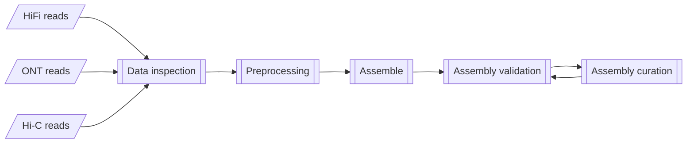
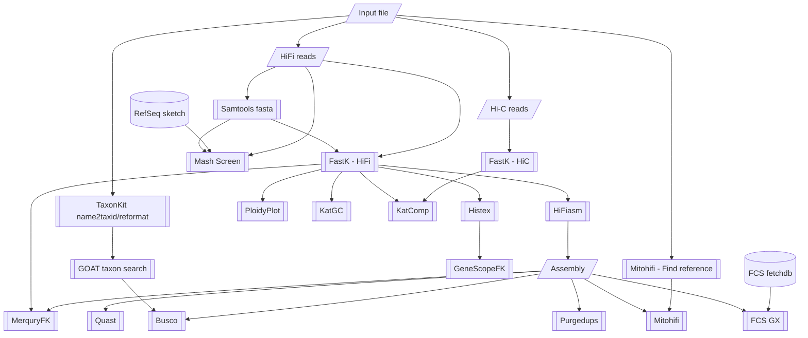

# Earth Biogenome Project - Pilot Workflow

The primary workflow for the Earth Biogenome Project Pilot at NBIS.

## Workflow overview

General aim:



Current implementation:



## Usage

```bash
nextflow run -params-file <params.yml> \
    [ -c <custom.config> ] \
    [ -profile <profile> ] \
    NBISweden/Earth-Biogenome-Project-pilot
```

where:
- `params.yml` is a YAML formatted file containing workflow parameters
    such as input paths to the assembly specification, and settings for tools within the workflow.

    Example:

    ```yml
    input: 'assembly_spec.yml'
    outdir: results
    fastk: # Optional
      kmer_size: 31 # default 31
    genescopefk: # Optional
      kmer_size: 31 # default 31
    hifiasm: # Optional, default = no extra options: Key (e.g. 'opts01') is used in assembly build name (e.g., 'hifiasm-raw-opts01').
      opts01: "--opts A"
      opts02: "--opts B"
    busco: # Optional, default: retrieved from GOAT
      lineages: 'auto' # comma separated string of lineages or auto.
    ```

    Alternatively parameters can be provided on the
    command-line using the `--parameter` notation (e.g., `--input <path>` ).
- `<custom.config>` is a Nextflow configuration file which provides
    additional configuration. This is used to customise settings other than
    workflow parameters, such as cpus, time, and command-line options to tools.

    Example:
    ```nextflow
    process {
        withName: 'BUSCO' {  // Selects the process to apply settings.
            cpus     = 6     // Overrides cpu settings defined in nextflow.config
            time     = 4.d   // Overrides time settings defined in nextflow.config to 4 days. Use .h for hours, .m for minutes.
            memory   = 20.G  // Overrides memory settings defined in nextflow.config to 20 GB.
            // ext.args supplies command-line options to the process tool
            // overrides settings found in configs/modules.config
            ext.args = '--long'  // Supplies these as command-line options to Busco
        }
    }
    ```
- `<profile>` is one of the preconfigured execution profiles
    (`uppmax`, `singularity_local`, `docker_local`, etc: see nextflow.config). Alternatively,
    you can provide a custom configuration to configure this workflow
    to your execution environment. See [Nextflow Configuration](https://www.nextflow.io/docs/latest/config.html#scope-executor)
    for more details.


### Workflow parameter inputs

Mandatory:

- `input`: A YAML formatted input file.
    Example `assembly_spec.yml` (See also [test profile input](assets/test_hsapiens.yml) TODO:: Update test profile):

    ```yml
    sample:                          # Required: Meta data
      name: 'Laetiporus sulphureus'  # Required: Species name. Correct spelling is important to look up species information.
      ploidy: 2                      # Optional: Estimated ploidy (default: retrieved from GOAT)
      genome_size: 2345              # Optional: Estimated genome size (default: retrieved from GOAT)
      haploid_number: 13             # Optional: Estimated haploid chromosome count (default: retrieved from GOAT)
    assembly:                        # Optional: List of assemblies to curate and validate.
      - assembler: hifiasm           # For each entry, the assembler,
        stage: raw                   # stage of assembly,
        id: uuid                     # unique id,
        pri_fasta: /path/to/primary_asm.fasta # and paths to sequences are required.
        alt_fasta: /path/to/alternate_asm.fasta
        pri_gfa: /path/to/primary_asm.gfa
        alt_gfa: /path/to/alternate_asm.gfa
      - assembler: ipa
        stage: raw
        id: uuid
        pri_fasta: /path/to/primary_asm.fasta
        alt_fasta: /path/to/alternate_asm.fasta
    hic:                             # Optional: List of hi-c reads to QC and use for scaffolding
      - read1: '/path/to/raw/data/hic/LS_HIC_R001_1.fastq.gz'
        read2: '/path/to/raw/data/hic/LS_HIC_R001_2.fastq.gz'
    hifi:                            # Required: List of hifi-reads to QC and use for assembly/validation
      - reads: '/path/to/raw/data/hifi/LS_HIFI_R001.bam'
    rnaseq:                          # Optional: List of Rna-seq reads to use for validation
      - read1: '/path/to/raw/data/rnaseq/LS_RNASEQ_R001_1.fastq.gz'
        read2: '/path/to/raw/data/rnaseq/LS_RNASEQ_R001_2.fastq.gz'
    isoseq:                          # Optional: List of Isoseq reads to use for validation
      - reads: '/path/to/raw/data/isoseq/LS_ISOSEQ_R001.bam'
    ```


Optional:

- `outdir`: The publishing path for results (default: `results`).
- `publish_mode`: (values: `'symlink'` (default), `'copy'`) The file
publishing method from the intermediate results folders
(see [Table of publish modes](https://www.nextflow.io/docs/latest/process.html#publishdir)).
- `steps`: The workflow steps to execute (default is all steps). Choose from:

    - `inspect`: 01 - Read inspection
    - `preprocess`: 02 - Read preprocessing
    - `assemble`: 03 - Assembly
    - `purge`: 04 - Duplicate purging
    - `polish`: 05 - Error polishing
    - `screen`: 06 - Contamination screening
    - `scaffold`: 07 - Scaffolding
    - `curate`: 08 - Rapid curation
    - `alignRNA`: 09 - Align RNAseq data

Software specific:

Tool specific settings are provided by supplying values to specific keys or supplying an array of
settings under a tool name. The input to `-params-file` would look like this:

```yml
input: assembly.yml
outdir: results
fastk:
  kmer_size: 31
genescopefk:
  kmer_size: 31
hifiasm:
  opts01: "--opts A"
  opts02: "--opts B"
busco:
  lineages: 'auto'
```

- `multiqc_config`: Path to MultiQC configuration file (default: `configs/multiqc_conf.yaml`).

Uppmax cluster specific:

- `project`: NAISS Compute allocation number.

### Workflow outputs

All results are published to the path assigned to the workflow parameter `results`.

TODO:: List folder contents in results file
### Customization for Uppmax

A custom profile named `uppmax` is available to run this workflow specifically
on UPPMAX clusters. The process `executor` is `slurm` so jobs are
submitted to the Slurm Queue Manager. All jobs submitted to slurm
must have a project allocation. This is automatically added to the `clusterOptions`
in the `uppmax` profile. All Uppmax clusters have node local disk space to do
computations, and prevent heavy input/output over the network (which
slows down the cluster for all).
The path to this disk space is provided by the `$SNIC_TMP` variable, used by
the `process.scratch` directive in the `uppmax` profile. Lastly
the profile enables the use of Singularity so that all processes must be
executed within Singularity containers. See [nextflow.config](nextflow.config)
for the profile specification.

The profile is enabled using the `-profile` parameter to nextflow:
```bash
nextflow run -profile uppmax <nextflow_script>
```

## Workflow organization

The workflows in this folder manage the execution of your analyses
from beginning to end.

```
workflow/
 | - .github/                        Github data such as actions to run
 | - assets/                         Workflow assets such as test samplesheets
 | - bin/                            Custom workflow scripts
 | - configs/                        Configuration files that govern workflow execution
 | - dockerfiles/                    Custom container definition files
 | - docs/                           Workflow usage and interpretation information
 | - modules/                        Process definitions for tools used in the workflow
 | - subworkflows/                   Custom workflows for different stages of the main analysis
 | - tests/                          Workflow tests
 | - main.nf                         The primary analysis script
 | - nextflow.config                 General Nextflow configuration
 \ - modules.json                    nf-core file which tracks modules/subworkflows from nf-core
```

