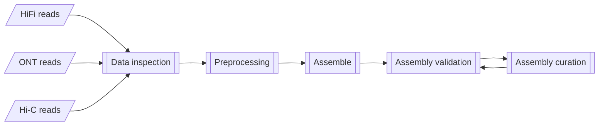
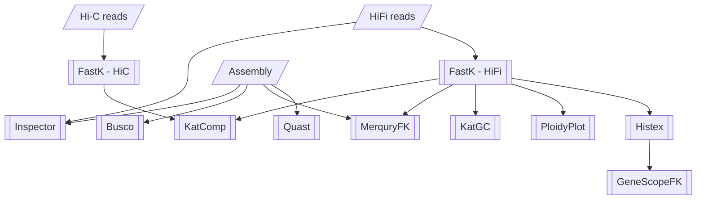

# Earth Biogenome Project - Pilot Workflow

The primary workflow for the Earth Biogenome Project Pilot at NBIS.

## Workflow overview

General aim:



Current implementation:



## Usage

```bash
nextflow run -params-file <params.yml> \
    [ -c <custom.config> ] \
    [ -profile <profile> ] \
    NBISweden/Earth-Biogenome-Project-pilot
```

where:
- `params.yml` is a YAML formatted file containing workflow parameters
    such as input paths to the data.
    A [params.yml template](params.yml.TEMPLATE) is provided to copy
    for convenience.
    Alternatively parameters can be provided on the
    command-line using the `--parameter` notation (e.g., `--input <path>` ).
- `<custom.config>` is a nextflow configuration file which provides
    additional configuration (see the [custom.config template](custom.config.TEMPLATE)).
- `<profile>` is one of the preconfigured execution profiles
    (`uppmax`, `singularity_local`, `docker_local`). Alternatively,
    you can provide a custom configuration to configure this workflow
    to your execution environment. See [Nextflow Configuration](https://www.nextflow.io/docs/latest/config.html#scope-executor)
    for more details.

Tool specific (module) parameters are supplied in the [modules file](configs/modules.config).
These can be overridden in the `nextflow.config` in the analysis directory,
by using process selectors. For example:
```
// Module settings
process {
    withName: 'FASTQC' {
        // Override ext.args to FastQC
        ext.args = '--quiet'
    }
}
```

### Workflow parameter inputs

Mandatory:

- `input`: A YAML formatted input file.

Optional:

- `outdir`: The publishing path for results (default: `results`).
- `publish_mode`: (values: `'symlink'` (default), `'copy'`) The file
publishing method from the intermediate results folders
(see [Table of publish modes](https://www.nextflow.io/docs/latest/process.html#publishdir)).
- `kmer_size`: The size of k-mer to use for histogram plotting.
- `ploidy`: The estimated ploidy.
- `steps`: The workflow steps to execute ( default is all steps. Choose from [`data_qc`,`preprocess`,`assemble`,`validate`,`curate`] ).

    Software specific:
    - `multiqc_config`: Path to MultiQC configuration file (default: `configs/multiqc_conf.yaml`).

    Software package manager specific:
    - `enable_conda`: Set to `true` to use conda as the software package manager (default: `false`).
    - `singularity_pull_docker_container`: Set to `true` if Singularity images should be
    built from the docker images, instead of retrieving existing Singularity images (default: `false`).

    Uppmax cluster specific:
    - `project`: SNIC Compute allocation number.

### Workflow outputs

All results are published to the path assigned to the workflow parameter `results`.

- `01_FastQC_sequence_check/`: FastQC output
- `02_Fastp_trimmed_sequences/`: FastP output
- `pipeline_info/`: A folder containing workflow execution details.
- `multiqc_report.html`: A MultiQC report summarising the results of data processing.

### Customisation for Uppmax

A custom profile named `uppmax` is available to run this workflow specifically
on UPPMAX clusters. The process `executor` is `slurm` so jobs are
submitted to the Slurm Queue Manager. All jobs submitted to slurm
must have a project allocation. This is automatically added to the `clusterOptions`
in the `uppmax` profile. All Uppmax clusters have node local disk space to do
computations, and prevent heavy input/output over the network (which
slows down the cluster for all).
The path to this disk space is provided by the `$SNIC_TMP` variable, used by
the `process.scratch` directive in the `uppmax` profile. Lastly
the profile enables the use of Singularity so that all processes must be
executed within Singularity containers. See [nextflow.config](nextflow.config)
for the profile specification.

The profile is enabled using the `-profile` parameter to nextflow:
```bash
nextflow run -profile uppmax <nextflow_script>
```

## Workflow organisation

The workflows in this folder manage the execution of your analyses
from beginning to end.

```
workflow/
 | - bin/                            Custom workflow scripts
 | - configs/                        Configuration files that govern workflow execution
 | - containers/                     Custom container definition files
 | - docs/                           Workflow usage and interpretation information
 | - modules/                        Process definitions for tools used in the workflow
 | - subworkflows/                   Custom workflows for different stages of the main analysis
 | - main.nf                         The primary analysis script
 | - nextflow.config                 General Nextflow configuration
 \ - params.config.TEMPLATE          A Template for parameter configuration
```

