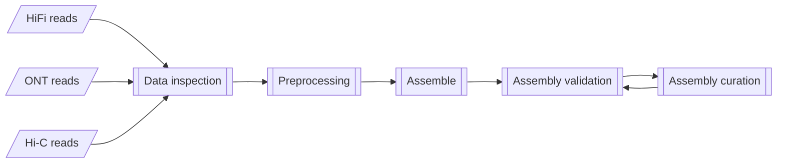
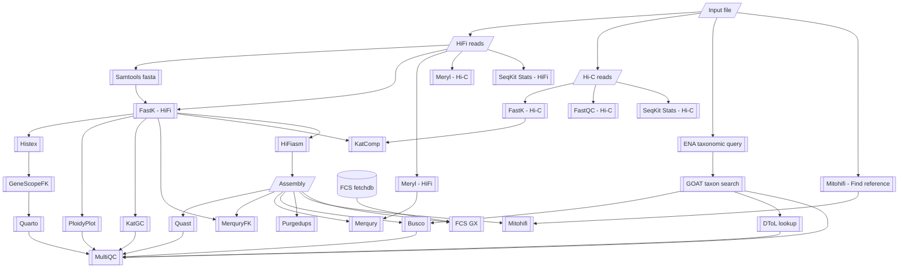

# Earth Biogenome Project - Pilot Workflow

The primary workflow for the Earth Biogenome Project Pilot at NBIS.

## Workflow overview

General aim:



Current implementation:



## Usage

```bash
nextflow run -params-file <params.yml> \
    [ -c <custom.config> ] \
    [ -profile <profile> ] \
    NBISweden/Earth-Biogenome-Project-pilot
```

where:
- `params.yml` is a YAML formatted file containing workflow parameters
    such as input paths to the assembly specification, and settings for tools within the workflow.

    Example:

    ```yml
    input: 'assembly_spec.yml'
    outdir: results
    fastk: # Optional
      kmer_size: 31 # default 31
    genescopefk: # Optional
      kmer_size: 31 # default 31
    hifiasm: # Optional, default = no extra options: Key (e.g. 'opts01') is used in assembly build name (e.g., 'hifiasm-raw-opts01').
      opts01: "--opts A"
      opts02: "--opts B"
    busco: # Optional, default: retrieved by GOAT_TAXONSEARCH
      lineages: 'auto' # comma separated string of lineages or auto.
    ```

    Alternatively parameters can be provided on the
    command-line using the `--parameter` notation (e.g., `--input <path>` ).
- `<custom.config>` is a Nextflow configuration file which provides
    additional configuration. This is used to customise settings other than
    workflow parameters, such as cpus, time, and command-line options to tools.

    Example:
    ```nextflow
    process {
        withName: 'BUSCO' {  // Selects the process to apply settings.
            cpus     = 6     // Overrides cpu settings defined in nextflow.config
            time     = 4.d   // Overrides time settings defined in nextflow.config to 4 days. Use .h for hours, .m for minutes.
            memory   = '20GB'  // Overrides memory settings defined in nextflow.config to 20 GB.
            // ext.args supplies command-line options to the process tool
            // overrides settings found in configs/modules.config
            ext.args = '--long'  // Supplies these as command-line options to Busco
        }
    }
    ```
- `<profile>` is one of the preconfigured execution profiles
    (`<cluster_specific_profile>`, `singularity`, `docker`, etc: see nextflow.config). Alternatively,
    you can provide a custom configuration to configure this workflow
    to your execution environment. See [Nextflow Configuration](https://www.nextflow.io/docs/latest/config.html#scope-executor)
    for more details.

### Workflow parameter inputs

Mandatory:

- `input`: A YAML formatted input file.
    Example `assembly_spec.yml` (See also [test profile input](assets/test_hsapiens.yml) TODO:: Update test profile):

    ```yml
    sample:                          # Required: Meta data
      name: 'Laetiporus sulphureus'  # Required: Species name. Correct spelling is important to look up species information.
      ploidy: 2                      # Optional: Estimated ploidy (default: retrieved by GOAT_TAXONSEARCH)
      genome_size: 2345              # Optional: Estimated genome size (default: retrieved by GOAT_TAXONSEARCH)
      haploid_number: 13             # Optional: Estimated haploid chromosome count (default: retrieved by GOAT_TAXONSEARCH)
      tax_id: 5630                   # Optional: Taxon ID (default: retrieved by ENA_TAXQUERY)
      genetic_code: 1                # Optional: Genetic code (default: retrieved by ENA_TAXQUERY)
      mito_code: 1                   # Optional: Mitochondrial genetic code (default: retrieved by ENA_TAXQUERY)
      domain: Eukaryota              # Optional: (default: retrived by ENA_TAXQUERY)
    assembly:                        # Optional: List of assemblies to curate and validate.
      - assembler: hifiasm           # For each entry, the assembler,
        stage: raw                   # stage of assembly (raw, decontaminated, purged, polished, scaffolded, curated),
        id: uuid                     # unique id,
        pri_fasta: /path/to/primary_asm.fasta # and paths to sequences are required.
        alt_fasta: /path/to/alternate_asm.fasta
        pri_gfa: /path/to/primary_asm.gfa
        alt_gfa: /path/to/alternate_asm.gfa
      - assembler: ipa
        stage: raw
        id: uuid
        pri_fasta: /path/to/primary_asm.fasta
        alt_fasta: /path/to/alternate_asm.fasta
    hic:                             # Optional: List of hi-c reads to QC and use for scaffolding
      - read1: '/path/to/raw/data/hic/LS_HIC_R001_1.fastq.gz'
        read2: '/path/to/raw/data/hic/LS_HIC_R001_2.fastq.gz'
    hifi:                            # Required: List of hifi-reads to QC and use for assembly/validation
      - reads: '/path/to/raw/data/hifi/LS_HIFI_R001.bam'
    rnaseq:                          # Optional: List of Rna-seq reads to use for validation
      - read1: '/path/to/raw/data/rnaseq/LS_RNASEQ_R001_1.fastq.gz'
        read2: '/path/to/raw/data/rnaseq/LS_RNASEQ_R001_2.fastq.gz'
    isoseq:                          # Optional: List of Isoseq reads to use for validation
      - reads: '/path/to/raw/data/isoseq/LS_ISOSEQ_R001.bam'
    ```

Optional:

- `outdir`: The publishing path for results (default: `results`).
- `publish_mode`: (values: `'symlink'` (default), `'copy'`) The file
publishing method from the intermediate results folders
(see [Table of publish modes](https://www.nextflow.io/docs/latest/process.html#publishdir)).
- `steps`: The workflow steps to execute (default is all steps). Choose from:

    - `inspect`: 01 - Read inspection
    - `preprocess`: 02 - Read preprocessing
    - `assemble`: 03 - Assembly
    - `screen`: 04 - Contamination screening
    - `purge`: 05 - Duplicate purging
    - `polish`: 06 - Error polishing (TODO: In development)
    - `scaffold`: 07 - Scaffolding
    - `curate`: 08 - Rapid curation
    - `alignRNA`: 09 - Align RNAseq data

Software specific:

Tool specific settings are provided by supplying values to specific keys or supplying an array of
settings under a tool name. The input to `-params-file` would look like this:

```yml
input: assembly.yml
outdir: results
fastk:
  kmer_size: 31
genescopefk:
  kmer_size: 31
hifiasm:
  opts01: "--opts A"
  opts02: "--opts B"
busco:
  lineages: 'auto'
```

- `multiqc_config`: Path to MultiQC configuration file (default: `configs/multiqc_conf.yaml`).

### Workflow outputs

All results are published to the path assigned to the workflow parameter `outdir`.

<details>
<summary>Expand for example results directory structure</summary>
```
results
├── 01_read_inspection
│   ├── dtol_search
│   │   └── 7227_tol_info.json
│   ├── fastqc_hic
│   │   ├── dmel_2Mb_p1_R1_1_fastqc.html
│   │   ├── dmel_2Mb_p1_R1_1_fastqc.zip
│   │   ├── dmel_2Mb_p1_R1_2_fastqc.html
│   │   ├── dmel_2Mb_p1_R1_2_fastqc.zip
│   │   ├── dmel_2Mb_p2_R1_1_fastqc.html
│   │   ├── dmel_2Mb_p2_R1_1_fastqc.zip
│   │   ├── dmel_2Mb_p2_R1_2_fastqc.html
│   │   └── dmel_2Mb_p2_R1_2_fastqc.zip
│   ├── genescopefk
│   │   ├── Drosophila_melanogaster_linear_plot.png
│   │   ├── Drosophila_melanogaster_log_plot.png
│   │   ├── Drosophila_melanogaster_model.txt
│   │   ├── Drosophila_melanogaster_summary.txt
│   │   ├── Drosophila_melanogaster_transformed_linear_plot.png
│   │   └── Drosophila_melanogaster_transformed_log_plot.png
│   ├── kat_comp
│   │   ├── Drosophila_melanogaster_katcomp.fi.png
│   │   ├── Drosophila_melanogaster_katcomp.ln.png
│   │   └── Drosophila_melanogaster_katcomp.st.png
│   ├── katgc
│   │   ├── Drosophila_melanogaster_katgc.fi.png
│   │   ├── Drosophila_melanogaster_katgc.ln.png
│   │   └── Drosophila_melanogaster_katgc.st.png
│   ├── ploidyplot
│   │   ├── Drosophila_melanogaster_ploidyplot.fi.png
│   │   ├── Drosophila_melanogaster_ploidyplot.ln.png
│   │   └── Drosophila_melanogaster_ploidyplot.st.png
│   ├── seqkit_hic_stats
│   │   ├── dmel_2Mb_p1_R1_hic.tsv
│   │   └── dmel_2Mb_p2_R1_hic.tsv
│   └── seqkit_hifi_stats
│       └── dmel_2Mb_hifi.tsv
├── 02_read_preprocessing
│   ├── hi-c_cram
│   │   ├── dmel_2Mb_p1.cram
│   │   ├── dmel_2Mb_p1.cram.crai
│   │   ├── dmel_2Mb_p2.cram
│   │   └── dmel_2Mb_p2.cram.crai
│   └── hi-c_trimmed_fastq
│       ├── dmel_2Mb_p1_1.fastp.fastq.gz
│       ├── dmel_2Mb_p1_2.fastp.fastq.gz
│       ├── dmel_2Mb_p1.fastp.html
│       ├── dmel_2Mb_p1.fastp.json
│       ├── dmel_2Mb_p1.fastp.log
│       ├── dmel_2Mb_p2_1.fastp.fastq.gz
│       ├── dmel_2Mb_p2_2.fastp.fastq.gz
│       ├── dmel_2Mb_p2.fastp.html
│       ├── dmel_2Mb_p2.fastp.json
│       └── dmel_2Mb_p2.fastp.log
├── 03_assembly
│   ├── busco
│   │   └── hifiasm-raw-default
│   │       ├── hifiasm-raw-default-bacteria_odb10-busco
│   │       │   ├── hifiasm-raw-default.asm.bp.p_ctg.fasta
│   │       │   │   ├── logs
│   │       │   │   │   ├── bbtools_err.log
│   │       │   │   │   ├── bbtools_out.log
│   │       │   │   │   ├── hmmsearch_err.log
│   │       │   │   │   ├── hmmsearch_out.log
│   │       │   │   │   ├── prodigal_err.log
│   │       │   │   │   └── prodigal_out.log
│   │       │   │   ├── prodigal_output
│   │       │   │   │   └── predicted_genes
│   │       │   │   │       ├── predicted.faa
│   │       │   │   │       ├── predicted.fna
│   │       │   │   │       └── tmp
│   │       │   │   │           ├── prodigal_mode_single_code_11_err.log
│   │       │   │   │           ├── prodigal_mode_single_code_11_out.log
│   │       │   │   │           ├── prodigal_mode_single_code_11.faa
│   │       │   │   │           ├── prodigal_mode_single_code_11.fna
│   │       │   │   │           ├── prodigal_mode_single_code_4_err.log
│   │       │   │   │           ├── prodigal_mode_single_code_4_out.log
│   │       │   │   │           ├── prodigal_mode_single_code_4.faa
│   │       │   │   │           └── prodigal_mode_single_code_4.fna
│   │       │   │   └── run_bacteria_odb10
│   │       │   │       ├── busco_sequences
│   │       │   │       │   ├── fragmented_busco_sequences.tar.gz
│   │       │   │       │   ├── multi_copy_busco_sequences.tar.gz
│   │       │   │       │   └── single_copy_busco_sequences.tar.gz
│   │       │   │       ├── full_table.tsv
│   │       │   │       ├── hmmer_output.tar.gz
│   │       │   │       ├── missing_busco_list.tsv
│   │       │   │       ├── short_summary.json
│   │       │   │       └── short_summary.txt
│   │       │   └── logs
│   │       │       └── busco.log
│   │       ├── hifiasm-raw-default-bacteria_odb10-busco.batch_summary.txt
│   │       ├── short_summary.specific.bacteria_odb10.hifiasm-raw-default.asm.bp.p_ctg.fasta.json
│   │       └── short_summary.specific.bacteria_odb10.hifiasm-raw-default.asm.bp.p_ctg.fasta.txt
│   ├── gfastats
│   │   └── hifiasm-raw-default
│   │       └── hifiasm-raw-default.asm.bp.p_ctg.fasta.assembly_summary
│   ├── hifiasm-raw-default
│   │   ├── hifiasm-raw-default.asm.bp.hap1.p_ctg.gfa
│   │   ├── hifiasm-raw-default.asm.bp.hap2.p_ctg.gfa
│   │   ├── hifiasm-raw-default.asm.bp.p_ctg.fasta.gz
│   │   ├── hifiasm-raw-default.asm.bp.p_ctg.gfa
│   │   ├── hifiasm-raw-default.asm.bp.p_utg.gfa
│   │   ├── hifiasm-raw-default.asm.bp.r_utg.gfa
│   │   ├── hifiasm-raw-default.asm.ec.bin
│   │   ├── hifiasm-raw-default.asm.ovlp.reverse.bin
│   │   ├── hifiasm-raw-default.asm.ovlp.source.bin
│   │   └── hifiasm-raw-default.stderr.log
│   ├── merqury
│   │   └── hifiasm-raw-default
│   │       ├── Drosophila_melanogaster_hifi.unionsumdb.hist.ploidy
│   │       ├── hifiasm-raw-default_merqury.completeness.stats
│   │       ├── hifiasm-raw-default_merqury.dist_only.hist
│   │       ├── hifiasm-raw-default_merqury.hifiasm-raw-default.asm.bp.p_ctg.qv
│   │       ├── hifiasm-raw-default_merqury.hifiasm-raw-default.asm.bp.p_ctg.spectra-cn.fl.png
│   │       ├── hifiasm-raw-default_merqury.hifiasm-raw-default.asm.bp.p_ctg.spectra-cn.hist
│   │       ├── hifiasm-raw-default_merqury.hifiasm-raw-default.asm.bp.p_ctg.spectra-cn.ln.png
│   │       ├── hifiasm-raw-default_merqury.hifiasm-raw-default.asm.bp.p_ctg.spectra-cn.st.png
│   │       ├── hifiasm-raw-default_merqury.qv
│   │       ├── hifiasm-raw-default_merqury.spectra-asm.fl.png
│   │       ├── hifiasm-raw-default_merqury.spectra-asm.hist
│   │       ├── hifiasm-raw-default_merqury.spectra-asm.ln.png
│   │       ├── hifiasm-raw-default_merqury.spectra-asm.st.png
│   │       ├── hifiasm-raw-default.asm.bp.p_ctg_only.bed
│   │       └── hifiasm-raw-default.asm.bp.p_ctg_only.wig
│   └── merquryfk
│       └── hifiasm-raw-default
│           ├── hifiasm-raw-default_merquryfk.cni.gz
│           ├── hifiasm-raw-default_merquryfk.completeness.stats
│           ├── hifiasm-raw-default_merquryfk.false_duplications.tsv
│           ├── hifiasm-raw-default_merquryfk.hifiasm-raw-default.asm.bp.p_ctg_only.bed
│           ├── hifiasm-raw-default_merquryfk.hifiasm-raw-default.asm.bp.p_ctg.qv
│           ├── hifiasm-raw-default_merquryfk.hifiasm-raw-default.asm.bp.p_ctg.spectra-cn.fl.png
│           ├── hifiasm-raw-default_merquryfk.hifiasm-raw-default.asm.bp.p_ctg.spectra-cn.ln.png
│           ├── hifiasm-raw-default_merquryfk.hifiasm-raw-default.asm.bp.p_ctg.spectra-cn.st.png
│           ├── hifiasm-raw-default_merquryfk.qv
│           ├── hifiasm-raw-default_merquryfk.spectra-asm.fl.png
│           ├── hifiasm-raw-default_merquryfk.spectra-asm.ln.png
│           └── hifiasm-raw-default_merquryfk.spectra-asm.st.png
├── 05_duplicate_purging
│   ├── busco
│   │   └── hifiasm-purged-default
│   │       ├── hifiasm-purged-default-bacteria_odb10-busco
│   │       │   ├── Drosophila_melanogaster_hifiasm-purged-default_hap0.purged_fold.fasta
│   │       │   │   ├── logs
│   │       │   │   │   ├── bbtools_err.log
│   │       │   │   │   ├── bbtools_out.log
│   │       │   │   │   ├── hmmsearch_err.log
│   │       │   │   │   ├── hmmsearch_out.log
│   │       │   │   │   ├── prodigal_err.log
│   │       │   │   │   └── prodigal_out.log
│   │       │   │   ├── prodigal_output
│   │       │   │   │   └── predicted_genes
│   │       │   │   │       ├── predicted.faa
│   │       │   │   │       ├── predicted.fna
│   │       │   │   │       └── tmp
│   │       │   │   │           ├── prodigal_mode_single_code_11_err.log
│   │       │   │   │           ├── prodigal_mode_single_code_11_out.log
│   │       │   │   │           ├── prodigal_mode_single_code_11.faa
│   │       │   │   │           ├── prodigal_mode_single_code_11.fna
│   │       │   │   │           ├── prodigal_mode_single_code_4_err.log
│   │       │   │   │           ├── prodigal_mode_single_code_4_out.log
│   │       │   │   │           ├── prodigal_mode_single_code_4.faa
│   │       │   │   │           └── prodigal_mode_single_code_4.fna
│   │       │   │   └── run_bacteria_odb10
│   │       │   │       ├── busco_sequences
│   │       │   │       │   ├── fragmented_busco_sequences.tar.gz
│   │       │   │       │   ├── multi_copy_busco_sequences.tar.gz
│   │       │   │       │   └── single_copy_busco_sequences.tar.gz
│   │       │   │       ├── full_table.tsv
│   │       │   │       ├── hmmer_output.tar.gz
│   │       │   │       ├── missing_busco_list.tsv
│   │       │   │       ├── short_summary.json
│   │       │   │       └── short_summary.txt
│   │       │   └── logs
│   │       │       └── busco.log
│   │       ├── hifiasm-purged-default-bacteria_odb10-busco.batch_summary.txt
│   │       ├── short_summary.specific.bacteria_odb10.Drosophila_melanogaster_hifiasm-purged-default_hap0.purged_fold.fasta.json
│   │       └── short_summary.specific.bacteria_odb10.Drosophila_melanogaster_hifiasm-purged-default_hap0.purged_fold.fasta.txt
│   ├── gfastats
│   │   └── hifiasm-purged-default
│   │       └── Drosophila_melanogaster_hifiasm-purged-default_hap0.purged_fold.assembly_summary
│   ├── merqury
│   │   └── hifiasm-purged-default
│   │       ├── Drosophila_melanogaster_hifi.unionsumdb.hist.ploidy
│   │       ├── Drosophila_melanogaster_hifiasm-purged-default_hap0.hap_fold_only.bed
│   │       ├── Drosophila_melanogaster_hifiasm-purged-default_hap0.hap_fold_only.wig
│   │       ├── Drosophila_melanogaster_hifiasm-purged-default_hap0.purged_fold_only.bed
│   │       ├── Drosophila_melanogaster_hifiasm-purged-default_hap0.purged_fold_only.wig
│   │       ├── hifiasm-purged-default_merqury.completeness.stats
│   │       ├── hifiasm-purged-default_merqury.dist_only.hist
│   │       ├── hifiasm-purged-default_merqury.Drosophila_melanogaster_hifiasm-purged-default_hap0.hap_fold.qv
│   │       ├── hifiasm-purged-default_merqury.Drosophila_melanogaster_hifiasm-purged-default_hap0.hap_fold.spectra-cn.fl.png
│   │       ├── hifiasm-purged-default_merqury.Drosophila_melanogaster_hifiasm-purged-default_hap0.hap_fold.spectra-cn.hist
│   │       ├── hifiasm-purged-default_merqury.Drosophila_melanogaster_hifiasm-purged-default_hap0.hap_fold.spectra-cn.ln.png
│   │       ├── hifiasm-purged-default_merqury.Drosophila_melanogaster_hifiasm-purged-default_hap0.hap_fold.spectra-cn.st.png
│   │       ├── hifiasm-purged-default_merqury.Drosophila_melanogaster_hifiasm-purged-default_hap0.purged_fold.qv
│   │       ├── hifiasm-purged-default_merqury.Drosophila_melanogaster_hifiasm-purged-default_hap0.purged_fold.spectra-cn.fl.png
│   │       ├── hifiasm-purged-default_merqury.Drosophila_melanogaster_hifiasm-purged-default_hap0.purged_fold.spectra-cn.hist
│   │       ├── hifiasm-purged-default_merqury.Drosophila_melanogaster_hifiasm-purged-default_hap0.purged_fold.spectra-cn.ln.png
│   │       ├── hifiasm-purged-default_merqury.Drosophila_melanogaster_hifiasm-purged-default_hap0.purged_fold.spectra-cn.st.png
│   │       ├── hifiasm-purged-default_merqury.qv
│   │       ├── hifiasm-purged-default_merqury.spectra-asm.fl.png
│   │       ├── hifiasm-purged-default_merqury.spectra-asm.hist
│   │       ├── hifiasm-purged-default_merqury.spectra-asm.ln.png
│   │       ├── hifiasm-purged-default_merqury.spectra-asm.st.png
│   │       ├── hifiasm-purged-default_merqury.spectra-cn.fl.png
│   │       ├── hifiasm-purged-default_merqury.spectra-cn.hist
│   │       ├── hifiasm-purged-default_merqury.spectra-cn.ln.png
│   │       └── hifiasm-purged-default_merqury.spectra-cn.st.png
│   ├── merquryfk
│   │   └── hifiasm-purged-default
│   │       ├── hifiasm-purged-default_merquryfk.cni.gz
│   │       ├── hifiasm-purged-default_merquryfk.completeness.stats
│   │       ├── hifiasm-purged-default_merquryfk.Drosophila_melanogaster_hifiasm-purged-default_hap0.hap_fold_only.bed
│   │       ├── hifiasm-purged-default_merquryfk.Drosophila_melanogaster_hifiasm-purged-default_hap0.hap_fold.qv
│   │       ├── hifiasm-purged-default_merquryfk.Drosophila_melanogaster_hifiasm-purged-default_hap0.hap_fold.spectra-cn.fl.png
│   │       ├── hifiasm-purged-default_merquryfk.Drosophila_melanogaster_hifiasm-purged-default_hap0.hap_fold.spectra-cn.ln.png
│   │       ├── hifiasm-purged-default_merquryfk.Drosophila_melanogaster_hifiasm-purged-default_hap0.hap_fold.spectra-cn.st.png
│   │       ├── hifiasm-purged-default_merquryfk.Drosophila_melanogaster_hifiasm-purged-default_hap0.purged_fold_only.bed
│   │       ├── hifiasm-purged-default_merquryfk.Drosophila_melanogaster_hifiasm-purged-default_hap0.purged_fold.qv
│   │       ├── hifiasm-purged-default_merquryfk.Drosophila_melanogaster_hifiasm-purged-default_hap0.purged_fold.spectra-cn.fl.png
│   │       ├── hifiasm-purged-default_merquryfk.Drosophila_melanogaster_hifiasm-purged-default_hap0.purged_fold.spectra-cn.ln.png
│   │       ├── hifiasm-purged-default_merquryfk.Drosophila_melanogaster_hifiasm-purged-default_hap0.purged_fold.spectra-cn.st.png
│   │       ├── hifiasm-purged-default_merquryfk.false_duplications.tsv
│   │       ├── hifiasm-purged-default_merquryfk.qv
│   │       ├── hifiasm-purged-default_merquryfk.spectra-asm.fl.png
│   │       ├── hifiasm-purged-default_merquryfk.spectra-asm.ln.png
│   │       ├── hifiasm-purged-default_merquryfk.spectra-asm.st.png
│   │       ├── hifiasm-purged-default_merquryfk.spectra-cn.fl.png
│   │       ├── hifiasm-purged-default_merquryfk.spectra-cn.ln.png
│   │       └── hifiasm-purged-default_merquryfk.spectra-cn.st.png
│   └── purge_dups
│       ├── Drosophila_melanogaster_hifiasm-purged-default_hap0.dups.bed
│       ├── Drosophila_melanogaster_hifiasm-purged-default_hap0.hap.fa
│       ├── Drosophila_melanogaster_hifiasm-purged-default_hap0.merged.fasta.gz
│       ├── Drosophila_melanogaster_hifiasm-purged-default_hap0.purge_dups.log
│       ├── Drosophila_melanogaster_hifiasm-purged-default_hap0.purged.fa
│       ├── Drosophila_melanogaster_hifiasm-purged-default_hap0.split.fasta.gz
│       ├── Drosophila_melanogaster_hifiasm-purged-default_purgedups_hist.png
│       ├── Drosophila_melanogaster.calcuts.log
│       ├── Drosophila_melanogaster.cutoffs
│       ├── Drosophila_melanogaster.PB.base.cov
│       └── Drosophila_melanogaster.PB.stat
├── 07_scaffolding
│   ├── busco
│   │   └── hifiasm-scaffolded-default
│   │       ├── hifiasm-scaffolded-default-bacteria_odb10-busco
│   │       │   ├── Drosophila_melanogaster_hifiasm-scaffolded-default_scaffolds_final.fa
│   │       │   │   ├── logs
│   │       │   │   │   ├── bbtools_err.log
│   │       │   │   │   ├── bbtools_out.log
│   │       │   │   │   ├── hmmsearch_err.log
│   │       │   │   │   ├── hmmsearch_out.log
│   │       │   │   │   ├── prodigal_err.log
│   │       │   │   │   └── prodigal_out.log
│   │       │   │   ├── prodigal_output
│   │       │   │   │   └── predicted_genes
│   │       │   │   │       ├── predicted.faa
│   │       │   │   │       ├── predicted.fna
│   │       │   │   │       └── tmp
│   │       │   │   │           ├── prodigal_mode_single_code_11_err.log
│   │       │   │   │           ├── prodigal_mode_single_code_11_out.log
│   │       │   │   │           ├── prodigal_mode_single_code_11.faa
│   │       │   │   │           ├── prodigal_mode_single_code_11.fna
│   │       │   │   │           ├── prodigal_mode_single_code_4_err.log
│   │       │   │   │           ├── prodigal_mode_single_code_4_out.log
│   │       │   │   │           ├── prodigal_mode_single_code_4.faa
│   │       │   │   │           └── prodigal_mode_single_code_4.fna
│   │       │   │   └── run_bacteria_odb10
│   │       │   │       ├── busco_sequences
│   │       │   │       │   ├── fragmented_busco_sequences.tar.gz
│   │       │   │       │   ├── multi_copy_busco_sequences.tar.gz
│   │       │   │       │   └── single_copy_busco_sequences.tar.gz
│   │       │   │       ├── full_table.tsv
│   │       │   │       ├── hmmer_output.tar.gz
│   │       │   │       ├── missing_busco_list.tsv
│   │       │   │       ├── short_summary.json
│   │       │   │       └── short_summary.txt
│   │       │   └── logs
│   │       │       └── busco.log
│   │       ├── hifiasm-scaffolded-default-bacteria_odb10-busco.batch_summary.txt
│   │       ├── short_summary.specific.bacteria_odb10.Drosophila_melanogaster_hifiasm-scaffolded-default_scaffolds_final.fa.json
│   │       └── short_summary.specific.bacteria_odb10.Drosophila_melanogaster_hifiasm-scaffolded-default_scaffolds_final.fa.txt
│   ├── gfastats
│   │   └── hifiasm-scaffolded-default
│   │       └── Drosophila_melanogaster_hifiasm-scaffolded-default_scaffolds_final.assembly_summary
│   ├── merqury
│   │   └── hifiasm-scaffolded-default
│   │       ├── Drosophila_melanogaster_hifi.unionsumdb.hist.ploidy
│   │       ├── Drosophila_melanogaster_hifiasm-purged-default_hap0.hap_fold_only.bed
│   │       ├── Drosophila_melanogaster_hifiasm-purged-default_hap0.hap_fold_only.wig
│   │       ├── Drosophila_melanogaster_hifiasm-scaffolded-default_scaffolds_final_only.bed
│   │       ├── Drosophila_melanogaster_hifiasm-scaffolded-default_scaffolds_final_only.wig
│   │       ├── hifiasm-scaffolded-default_merqury.completeness.stats
│   │       ├── hifiasm-scaffolded-default_merqury.dist_only.hist
│   │       ├── hifiasm-scaffolded-default_merqury.Drosophila_melanogaster_hifiasm-purged-default_hap0.hap_fold.qv
│   │       ├── hifiasm-scaffolded-default_merqury.Drosophila_melanogaster_hifiasm-purged-default_hap0.hap_fold.spectra-cn.fl.png
│   │       ├── hifiasm-scaffolded-default_merqury.Drosophila_melanogaster_hifiasm-purged-default_hap0.hap_fold.spectra-cn.hist
│   │       ├── hifiasm-scaffolded-default_merqury.Drosophila_melanogaster_hifiasm-purged-default_hap0.hap_fold.spectra-cn.ln.png
│   │       ├── hifiasm-scaffolded-default_merqury.Drosophila_melanogaster_hifiasm-purged-default_hap0.hap_fold.spectra-cn.st.png
│   │       ├── hifiasm-scaffolded-default_merqury.Drosophila_melanogaster_hifiasm-scaffolded-default_scaffolds_final.qv
│   │       ├── hifiasm-scaffolded-default_merqury.Drosophila_melanogaster_hifiasm-scaffolded-default_scaffolds_final.spectra-cn.fl.png
│   │       ├── hifiasm-scaffolded-default_merqury.Drosophila_melanogaster_hifiasm-scaffolded-default_scaffolds_final.spectra-cn.hist
│   │       ├── hifiasm-scaffolded-default_merqury.Drosophila_melanogaster_hifiasm-scaffolded-default_scaffolds_final.spectra-cn.ln.png
│   │       ├── hifiasm-scaffolded-default_merqury.Drosophila_melanogaster_hifiasm-scaffolded-default_scaffolds_final.spectra-cn.st.png
│   │       ├── hifiasm-scaffolded-default_merqury.qv
│   │       ├── hifiasm-scaffolded-default_merqury.spectra-asm.fl.png
│   │       ├── hifiasm-scaffolded-default_merqury.spectra-asm.hist
│   │       ├── hifiasm-scaffolded-default_merqury.spectra-asm.ln.png
│   │       ├── hifiasm-scaffolded-default_merqury.spectra-asm.st.png
│   │       ├── hifiasm-scaffolded-default_merqury.spectra-cn.fl.png
│   │       ├── hifiasm-scaffolded-default_merqury.spectra-cn.hist
│   │       ├── hifiasm-scaffolded-default_merqury.spectra-cn.ln.png
│   │       └── hifiasm-scaffolded-default_merqury.spectra-cn.st.png
│   ├── merquryfk
│   │   └── hifiasm-scaffolded-default
│   │       ├── hifiasm-scaffolded-default_merquryfk.cni.gz
│   │       ├── hifiasm-scaffolded-default_merquryfk.completeness.stats
│   │       ├── hifiasm-scaffolded-default_merquryfk.Drosophila_melanogaster_hifiasm-purged-default_hap0.hap_fold_only.bed
│   │       ├── hifiasm-scaffolded-default_merquryfk.Drosophila_melanogaster_hifiasm-purged-default_hap0.hap_fold.qv
│   │       ├── hifiasm-scaffolded-default_merquryfk.Drosophila_melanogaster_hifiasm-purged-default_hap0.hap_fold.spectra-cn.fl.png
│   │       ├── hifiasm-scaffolded-default_merquryfk.Drosophila_melanogaster_hifiasm-purged-default_hap0.hap_fold.spectra-cn.ln.png
│   │       ├── hifiasm-scaffolded-default_merquryfk.Drosophila_melanogaster_hifiasm-purged-default_hap0.hap_fold.spectra-cn.st.png
│   │       ├── hifiasm-scaffolded-default_merquryfk.Drosophila_melanogaster_hifiasm-scaffolded-default_scaffolds_final_only.bed
│   │       ├── hifiasm-scaffolded-default_merquryfk.Drosophila_melanogaster_hifiasm-scaffolded-default_scaffolds_final.qv
│   │       ├── hifiasm-scaffolded-default_merquryfk.Drosophila_melanogaster_hifiasm-scaffolded-default_scaffolds_final.spectra-cn.fl.png
│   │       ├── hifiasm-scaffolded-default_merquryfk.Drosophila_melanogaster_hifiasm-scaffolded-default_scaffolds_final.spectra-cn.ln.png
│   │       ├── hifiasm-scaffolded-default_merquryfk.Drosophila_melanogaster_hifiasm-scaffolded-default_scaffolds_final.spectra-cn.st.png
│   │       ├── hifiasm-scaffolded-default_merquryfk.false_duplications.tsv
│   │       ├── hifiasm-scaffolded-default_merquryfk.qv
│   │       ├── hifiasm-scaffolded-default_merquryfk.spectra-asm.fl.png
│   │       ├── hifiasm-scaffolded-default_merquryfk.spectra-asm.ln.png
│   │       ├── hifiasm-scaffolded-default_merquryfk.spectra-asm.st.png
│   │       ├── hifiasm-scaffolded-default_merquryfk.spectra-cn.fl.png
│   │       ├── hifiasm-scaffolded-default_merquryfk.spectra-cn.ln.png
│   │       └── hifiasm-scaffolded-default_merquryfk.spectra-cn.st.png
│   ├── pairtools_dedup
│   │   └── hifiasm-scaffolded-default
│   │       └── Drosophila_melanogaster_hifiasm-scaffolded-default_dedup.pairs.stat
│   ├── pairtools_parse
│   │   └── hifiasm-scaffolded-default
│   │       ├── Drosophila_melanogaster_hifiasm-scaffolded-default_dmel_2Mb_p1_1.fastp.pairsam.stat
│   │       └── Drosophila_melanogaster_hifiasm-scaffolded-default_dmel_2Mb_p2_1.fastp.pairsam.stat
│   └── yahs
│       └── hifiasm-scaffolded-default
│           ├── Drosophila_melanogaster_hifiasm-scaffolded-default_scaffolds_final.agp
│           ├── Drosophila_melanogaster_hifiasm-scaffolded-default_scaffolds_final.fa
│           └── Drosophila_melanogaster_hifiasm-scaffolded-default.bin
├── 08_rapid_curation
│   ├── higlass
│   │   └── hifiasm-curated-default
│   │       ├── hifiasm-curated-default_gaps.bedgraph.beddb
│   │       ├── hifiasm-curated-default_merged_dupMarked.mcool
│   │       └── hifiasm-curated-default_telomer.bw
│   └── pretext
│       └── hifiasm-curated-default
│           └── hifiasm-curated-default_wTracks.pretext
├── 10_report
│   ├── assembly_report.html
│   ├── assembly_report.md
│   ├── multiqc-summary.html
│   ├── quast
│   │   ├── Drosophila_melanogaster_quast_report
│   │   │   ├── basic_stats
│   │   │   │   ├── cumulative_plot.pdf
│   │   │   │   ├── Drosophila_melanogaster_hifiasm-purged-default_hap0.purged_fold_GC_content_plot.pdf
│   │   │   │   ├── Drosophila_melanogaster_hifiasm-scaffolded-default_scaffolds_final_GC_content_plot.pdf
│   │   │   │   ├── GC_content_plot.pdf
│   │   │   │   ├── hifiasm-raw-default.asm.bp.p_ctg_GC_content_plot.pdf
│   │   │   │   └── Nx_plot.pdf
│   │   │   ├── icarus_viewers
│   │   │   │   └── contig_size_viewer.html
│   │   │   ├── icarus.html
│   │   │   ├── quast.log
│   │   │   ├── report.html
│   │   │   ├── report.pdf
│   │   │   ├── report.tex
│   │   │   ├── report.tsv
│   │   │   ├── report.txt
│   │   │   ├── transposed_report.tex
│   │   │   ├── transposed_report.tsv
│   │   │   └── transposed_report.txt
│   │   └── Drosophila_melanogaster_quast_report.tsv
│   └── versions.yml
└── pipeline_info
    ├── execution_report_2025-07-09_10-31-54.html
    ├── execution_timeline_2025-07-09_10-31-54.html
    ├── execution_trace_2025-07-09_10-31-54.txt
    └── pipeline_dag_2025-07-09_10-31-54.mmd
```
</details>

### Examples

- Run the workflow with the default parameters and all steps:

  ```bash
  nextflow run NBISweden/Earth-Biogenome-Project-pilot -params-file params.yml
  ```
  where `params.yml` is a YAML file containing the workflow parameters:
  ```yml
  input: 'assembly_spec.yml'
  ```
  and `assembly_spec.yml` is a YAML file containing the assembly specification
  ```yml
  sample:
    name: 'Laetiporus sulphureus'
  hifi:
    - reads: '/path/to/raw/data/hifi/LS_HIFI_R001.bam'
  hic:
    - read1: '/path/to/raw/data/hic/LS_HIC_R001_1.fastq.gz'
      read2: '/path/to/raw/data/hic/LS_HIC_R001_2.fastq.gz'
  ```

- Run purging to curation on an existing assembly:
  ```bash
  nextflow run NBISweden/Earth-Biogenome-Project-pilot -params-file params.yml
  ```
  where `params.yml` is a YAML file containing the workflow parameters:
  ```yml
  input: 'assembly_spec.yml'
  steps: 'purge,scaffold,curate'
  ```
  and `assembly_spec.yml` is a YAML file containing the assembly specification
  ```yml
  sample:
    name: 'Laetiporus sulphureus'
  assembly:
    - assembler: hifiasm
      stage: decontaminated
      id: uuid
      pri_fasta: '/path/to/primary_asm-hifiasm-decontaminated-uuid.fasta'
  hifi:
    - reads: '/path/to/raw/data/hifi/LS_HIFI_R001.bam'
  hic:
    - read1: '/path/to/raw/data/hic/LS_HIC_R001_1.fastq.gz'
      read2: '/path/to/raw/data/hic/LS_HIC_R001_2.fastq.gz'
  ```

- Run the workflow to only run assembly evaluation.
  ```bash
  nextflow run NBISweden/Earth-Biogenome-Project-pilot -params-file params.yml
  ```
  where `params.yml` is a YAML file containing the workflow parameters:
  ```yml
  input: 'assembly_spec.yml'
  ```
  and `assembly_spec.yml` is a YAML file containing the assembly specification
  ```yml
  sample:
    name: 'Laetiporus sulphureus'
  # Assembly to evaluate
  assembly:
    - assembler: hifiasm
      stage: curated
      id: uuid
      pri_fasta: '/path/to/primary_asm-hifiasm-curated-uuid.fasta'
  # Include HiFi reads for Merqury
  hifi:
    - reads: '/path/to/raw/data/hifi/LS_HIFI_R001.bam'
  ```

## Workflow organization

The workflows in this folder manage the execution of your analyses
from beginning to end.

```
workflow/
 | - .github/                        Github data such as actions to run
 | - assets/                         Workflow assets such as test samplesheets
 | - bin/                            Custom workflow scripts
 | - configs/                        Configuration files that govern workflow execution
 | - dockerfiles/                    Custom container definition files
 | - docs/                           Workflow usage and interpretation information
 | - modules/                        Process definitions for tools used in the workflow
 | - subworkflows/                   Custom workflows for different stages of the main analysis
 | - tests/                          Workflow tests
 | - main.nf                         The primary analysis script
 | - nextflow.config                 General Nextflow configuration
 \ - modules.json                    nf-core file which tracks modules/subworkflows from nf-core
```

