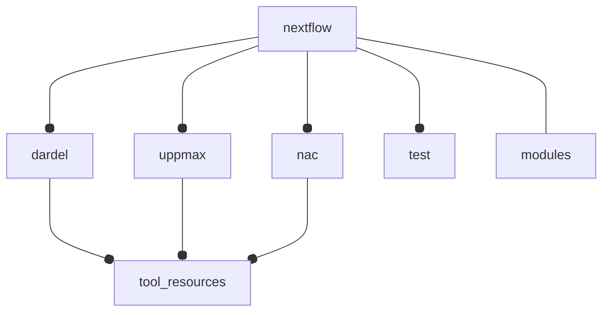

# Configuration

This folder contains workflow configuration files that affect various
aspects of running this pipeline.

These are all in some way included by the `nextflow.config`.

## Test Profile

The test profile is included through a profile called `test`, activated
using `-profile test`. It runs most of the pipeline on a tiny test dataset,
with reduced resources.

## Site Profiles

There are three site profiles included in this pipeline.

- dardel.config: Resource requirements for the HPC cluster `dardel` at PDC.
- uppmax.config: Resource requirements for the HPC cluster `rackham` at UPPMAX.
- nac.config: Resource requirements for the HPC cluster `nac` at NBIS.

Each of these include the config `tool_resources.config`, which can then
be further customized by site. This is separate from the `test` profile
which reduces the resource availability for all tools.

## Modules config

The `modules.config` supplies additional parameters to each module, such
as file prefixes, additional tool options, and which files should be published
where. This file extends the `nextflow.config`, supplying module specific
configuration. Resource requirements should not be added here as they will
also affect the test profile.

## Overview

