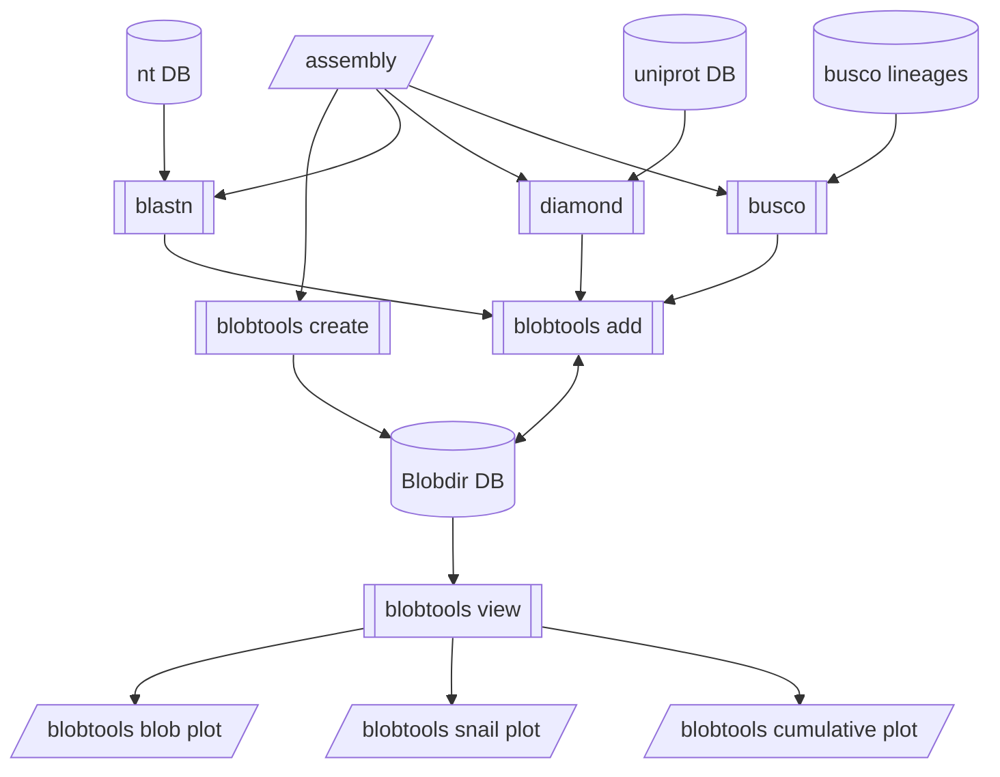

# Blobtoolkit subworkflow

```mermaid
flowchart TD
    fasta[/ assembly /] --> blobtools_create
    fasta --> blastn
    ntdb[( nt DB )] --> blastn
    uniprotdb[( uniprot DB )] --> diamond
    blobtools_create[[ blobtools create ]] --> blobdir[(Blobdir DB)] 
    blastn[[ blastn ]] --> blobtools_add[[ blobtools add ]]
    fasta --> diamond
    diamond[[ diamond ]] --> blobtools_add
    blobtools_add <--> blobdir
    fasta --> busco
    busco_lineages[( busco lineages )] --> busco
    busco[[busco]] --> blobtools_add 
    blobdir--> blobtools_view
    blobtools_view[[ blobtools view ]] --> blobtools_blob[/blobtools blob plot/]
    blobtools_view --> blobtools_snail[/blobtools snail plot/]
    blobtools_view --> blobtools_cumulative[/blobtools cumulative plot/]
```
